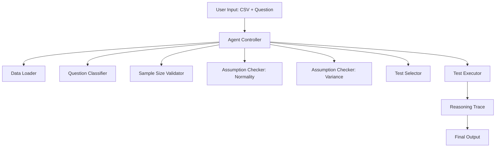

# Architecture

`agent/controller.py`'s `run_pipeline()` is the box labeled **Agent Controller** —
it is the only component that sequences the others, and it does so conditionally:
`Assumption Checker: Variance` is skipped entirely if `Assumption Checker:
Normality` fails, and everything after `Sample Size Validator` is skipped if that
check fails. The diagram shows *what* gets called; the branch logic in
[CLAUDE.md](../CLAUDE.md) and [docs/contract.md](contract.md) shows *when*.

**Every component in this diagram is deterministic Python code. There is no LLM
call anywhere in this pipeline** — including the Question Classifier, which uses
pure keyword/regex matching (see [docs/decisions.md](decisions.md) for why an
LLM-based classifier was considered and rejected).

## Hackathon checklist mapping

Honest mapping against the categories an agentic-system rubric typically asks
about — including the ones that don't apply here, and why not.

| Category | Applies? | Notes |
|---|---|---|
| **Observe → decide → act → evaluate → adapt loop** | **Yes** | This is the core of the system: each assumption-check *result* (observe) determines the next step to run (decide → act), and the final test choice is a direct consequence of intermediate outcomes, not a fixed sequence. |
| **Autonomous/adaptive decision-making** | **Yes** | The Test Selector picks one of three tests (or aborts) based on live Shapiro-Wilk/Levene's results — the same code path produces different actions for different data. |
| **Failure handling** | **Yes** | See the abort path for insufficient sample size (`n < 5` per group) — the pipeline stops before running any statistical test rather than producing an unreliable result. |
| **Human interaction / clarification** | **Yes** | The system asks for clarification (`needs_clarification` status) rather than guessing which columns to compare when a question can't be confidently classified as a two-group comparison. |
| **Memory / state** | **Not used** | Each run is independent; no long-term memory is needed for this problem, and adding one would be complexity without benefit. |
| **Tool use (LLM invoking external tools)** | **Not applicable** | There is no LLM anywhere in this pipeline, so there is no LLM-driven tool-calling. `core/` functions are invoked directly by deterministic Python control flow in `agent/controller.py`, not selected by a model. |
| **Retrieval / RAG** | **Not used** | The input is structured tabular data (two numeric columns), not an unstructured corpus — there is nothing here that retrieval would improve, and the hackathon explicitly does not require it. |
| **Multi-agent orchestration** | **Not used** | A single deterministic controller is sufficient for this branch logic. Splitting it into multiple communicating "agents" would add coordination overhead with no corresponding capability gain — the hackathon explicitly does not require a multi-agent framework either. |
